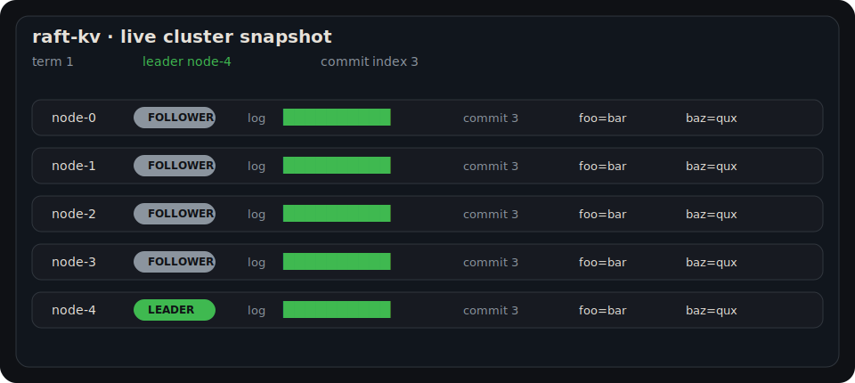
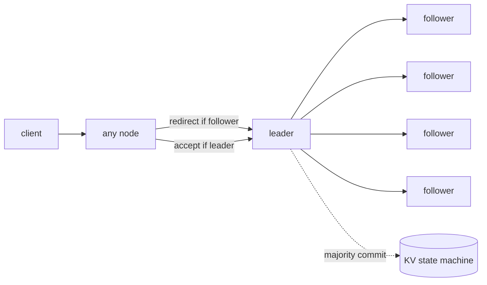
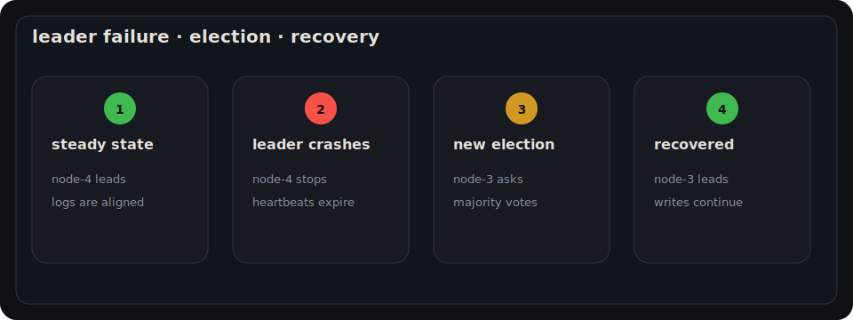
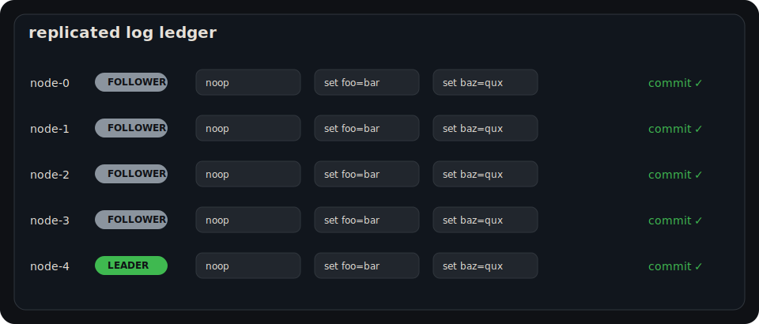

# raft-kv

A Raft-backed key-value store in Rust with deterministic simulation, raw TCP transport, and crash recovery.



## Features

- 3–5 node clusters
- leader election with randomized 150–300 ms election timeouts
- 50 ms heartbeats
- client redirects from followers to the current leader
- linearizable writes through the leader
- leader-served reads from the state machine
- log replication with majority commit
- leader backtracking with `next_index`
- deterministic partition/failover tests
- length-prefixed `bincode` frames over raw TCP
- one thread per TCP connection
- fsync-backed persistence for term, vote, log, and commit index
- process-level kill/restart test

## Shape of the system



## Failover story

The simulator records the path from a steady leader to crash, election, and recovery.



## Replicated log



## Replication snapshot

After `set foo bar` commits:

<!-- replication:start -->
| node | role | term | commit | applied | log | kv |
|---:|---|---:|---:|---:|---|---|
| 0 | Follower | 1 | 2 | 2 | [noop, set foo=bar] | foo=bar |
| 1 | Follower | 1 | 2 | 2 | [noop, set foo=bar] | foo=bar |
| 2 | Follower | 1 | 2 | 2 | [noop, set foo=bar] | foo=bar |
| 3 | Follower | 1 | 2 | 2 | [noop, set foo=bar] | foo=bar |
| 4 | Leader | 1 | 2 | 2 | [noop, set foo=bar] | foo=bar |
<!-- replication:end -->

## Metrics

Generated by `cargo run --release --bin raft-demo`. Simulated timings use fake Raft time; throughput uses local wall-clock time.

<!-- metrics:start -->
| metric | value |
|---|---:|
| cluster size tested | 5 nodes |
| election timeout | 150–300 ms |
| heartbeat interval | 50 ms |
| first leader elected | 88 ms simulated |
| failover after leader kill | 122 ms simulated |
| write visible on all nodes | 26 ms simulated |
| simulator write throughput | 5997 writes/sec |
| benchmark writes | 1000 writes |
| benchmark wall time | 166 ms |
| fault tolerance | 2 failed nodes in a 5-node cluster |
| process-level TCP tests | 1 kill/restart test |
<!-- metrics:end -->

## Run it

Start three nodes in separate terminals:

```bash
cargo run --bin raft-node -- 0 ./data/node0.bin \
  0=127.0.0.1:5000 1=127.0.0.1:5001 2=127.0.0.1:5002

cargo run --bin raft-node -- 1 ./data/node1.bin \
  0=127.0.0.1:5000 1=127.0.0.1:5001 2=127.0.0.1:5002

cargo run --bin raft-node -- 2 ./data/node2.bin \
  0=127.0.0.1:5000 1=127.0.0.1:5001 2=127.0.0.1:5002
```

Write and read:

```bash
cargo run --bin raft-client -- 127.0.0.1:5000 set foo bar
cargo run --bin raft-client -- 127.0.0.1:5000 get foo
```

Regenerate README artifacts:

```bash
cargo run --release --bin raft-demo
```

## Test it

```bash
cargo test
cargo clippy --all-targets -- -D warnings
```

The simulator includes Rust equivalents of the 6.824 tests: `TestInitialElection`, `TestReElection`, `TestBasicAgree`, `TestFailAgree`, `TestFailNoAgree`, `TestConcurrentStarts`, and `TestRejoin`.

The rest of the suite covers persistence, frame encoding, and a real TCP process cluster with kill/restart recovery.
