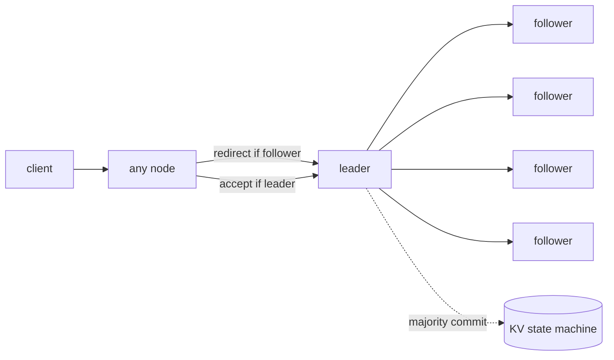

# raft-kv

[](https://github.com/wheevu/raft-kv/actions/workflows/ci.yml)

A learning implementation of the Raft consensus algorithm in Rust, with a deterministic simulator and a real process runner over raw TCP. Not a production database.


## What this is

A from-scratch Raft core that understands leader election, log replication, majority commit, and crash recovery. It can run in a deterministic discrete-event simulator (fake time, in-memory messages, injectable partitions and stops) or as real TCP processes with bincode framing and atomic disk persistence.

## Features

- 3–5 node clusters
- leader election with randomized 150–300 ms election timeouts
- 50 ms heartbeats
- client redirects from followers to the current leader
- replicated, committed writes through the leader
- committed-state reads through the leader (reads blocked until leader proves current term)
- log replication with majority commit
- leader backtracking via `next_index`
- deterministic partition/failover tests (simulator)
- length-prefixed `bincode` frames over raw TCP
- batched outbound messages per peer (one TCP connection per destination per send cycle)
- atomic persistence: term, vote, log, and commit index via temp-file fsync + rename
- process-level kill/restart and full-cluster restart integration tests

## Current limitations

- no log compaction or snapshots — the log grows forever
- no dynamic membership changes
- no TLS or authentication
- reads require the leader to have committed at least one entry in its current term (basic read-safety check, not full read-index)
- no connection keep-alive — each send cycle opens fresh TCP connections

## Shape of the system



## Failover story

The simulator records the path from a steady leader to crash, election, and recovery.


## Replicated log


## Replication snapshot

After `set foo bar` commits:

<!-- replication:start -->
| node | role | term | commit | applied | log | kv |
|---:|---|---:|---:|---:|---|---|
| 0 | Follower | 1 | 2 | 2 | [noop, set foo=bar] | foo=bar |
| 1 | Follower | 1 | 2 | 2 | [noop, set foo=bar] | foo=bar |
| 2 | Follower | 1 | 2 | 2 | [noop, set foo=bar] | foo=bar |
| 3 | Follower | 1 | 2 | 2 | [noop, set foo=bar] | foo=bar |
| 4 | Leader | 1 | 2 | 2 | [noop, set foo=bar] | foo=bar |
<!-- replication:end -->

## Metrics

Generated by `cargo run --release --bin raft-demo`. All timings are simulator time (not real wall-clock), except the throughput benchmark which measures wall time of the in-memory simulator. These are not real distributed-system performance numbers.

<!-- metrics:start -->
| metric | value |
|---|---:|
| cluster size tested | 5 nodes |
| election timeout | 150–300 ms |
| heartbeat interval | 50 ms |
| first leader elected | 88 ms simulated |
| failover after leader kill | 122 ms simulated |
| write visible on all nodes | 26 ms simulated |
| simulator write throughput | 5997 writes/sec |
| benchmark writes | 1000 writes |
| benchmark wall time | 166 ms |
| fault tolerance | 2 failed nodes in a 5-node cluster |
| process-level TCP tests | 2 (kill/restart, full-cluster restart) |
<!-- metrics:end -->

## Run it

Start three nodes in separate terminals:

```bash
cargo run --bin raft-node -- 0 ./data/node0.bin \
  0=127.0.0.1:5000 1=127.0.0.1:5001 2=127.0.0.1:5002

cargo run --bin raft-node -- 1 ./data/node1.bin \
  0=127.0.0.1:5000 1=127.0.0.1:5001 2=127.0.0.1:5002

cargo run --bin raft-node -- 2 ./data/node2.bin \
  0=127.0.0.1:5000 1=127.0.0.1:5001 2=127.0.0.1:5002
```

Write and read (the client accepts multiple peer addresses and follows redirects):

```bash
cargo run --bin raft-client -- 127.0.0.1:5000 127.0.0.1:5001 127.0.0.1:5002 set foo bar
cargo run --bin raft-client -- 127.0.0.1:5000 127.0.0.1:5001 127.0.0.1:5002 get foo
```

Regenerate README artifacts:

```bash
cargo run --release --bin raft-demo
```

## Test it

```bash
cargo test
cargo clippy --all-targets -- -D warnings
```

The simulator includes Rust equivalents of the 6.824 tests: `TestInitialElection`, `TestReElection`, `TestBasicAgree`, `TestFailAgree`, `TestFailNoAgree`, `TestConcurrentStarts`, and `TestRejoin`.

The suite also covers persistence, frame encoding, and real TCP process integration tests including leader kill/restart and full-cluster crash recovery.
